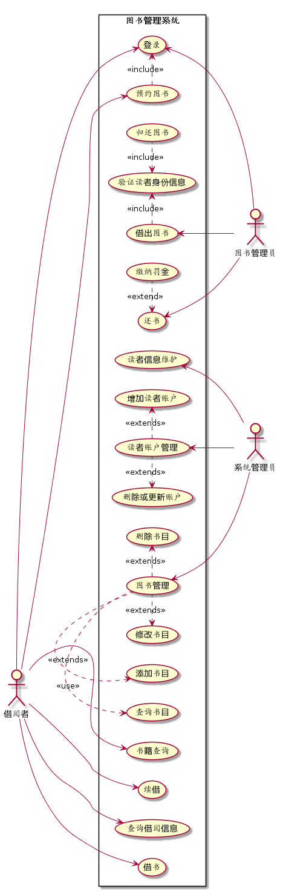
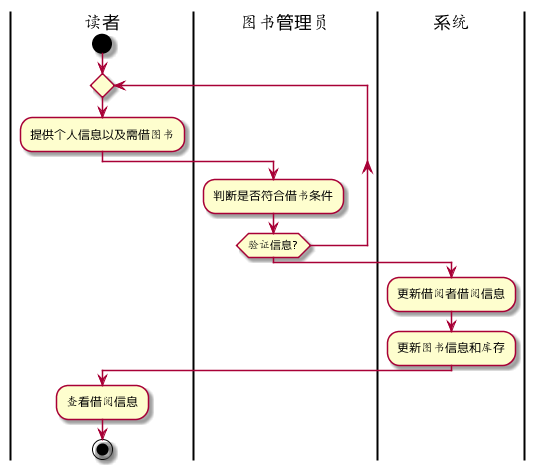
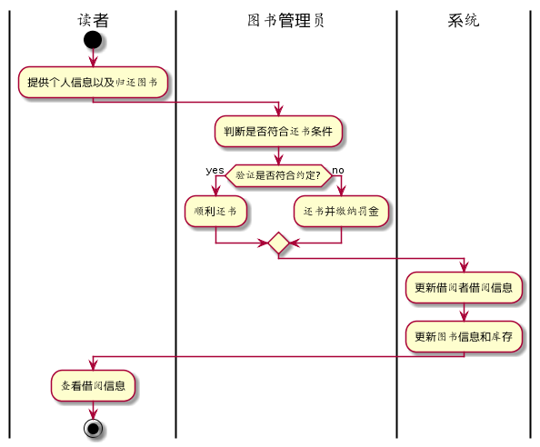

# 实验2：图书管理系统用例建模
|学号|班级|姓名|照片|
|:-------:|:-------------: | :----------:|:---:|
|201510414203|软件(本)15-2|陈亮||

## 1. 图书管理系统的用例关系图

### 1.1 用例图PlantUML源码如下：

``` usecase
@startuml
left to right direction
:系统管理员: as SysAdmin
:图书管理员: as Admin
:借阅者: as User


rectangle 图书管理系统{
User --> (登录)
User --> (书籍查询)
User --> (预约图书)
(预约图书).>(登录):<<include>>
User --> (续借)
User --> (查询借阅信息)
User --> (借书)

(借出图书).>(验证读者身份信息):<<include>>
(借出图书) <-- Admin
(验证读者身份信息)<.(归还图书):<<include>>
(还书)<.(缴纳罚金):<<extend>>
(还书) <- Admin
(登录) <-- Admin


(读者信息维护) <- SysAdmin
(读者账户管理).>(增加读者账户):<<extends>>
(读者账户管理) <- SysAdmin
(删除或更新账户)<.(读者账户管理):<<extends>>

(图书管理) <-- SysAdmin
(图书管理).>(删除书目):<<extends>>
(修改书目)<.(图书管理):<<extends>>
(添加书目)<.(图书管理):<<extends>>
(查询书目)<.(图书管理):<<use>>
}
@enduml
```


### 1.2. 用例图如下：




## 2. 参与者说明：

###     2.1 图书管理员

主要职责是：
- 对读者的借书、还书等操作进行处理。
- 收取读者缴纳的逾期费用。

###     2.2 读者

主要职责是：
- 通过查询图书来预约图书，借取续借或者归还图书。
- 查询自己的借阅信息。
- 还书，如果还书时间超过预期需要缴纳逾期罚款。

###     2.3 系统管理员
    
主要职责是：
- 图书管理，对书目信息进行增删查改
- 读者信息维护，对读者账户进行增删查改

##     3. 用例规约表

###     3.1 “借出图书”用例

|Title | 内容 |
|:------:|:------:|
|用例名称|借出图书|  
|参与者|图书管理员（主要参与者）、读者（次要参与者）|
|前置条件|图书管理员身份已认证|
|后置条件|更新库存数据|
|主事件流|1.图书管理员将读者账户信息提供给系统；<br>2.系统验证读者身份和借书条件；<br>3.图书管理员将读者所借图书输入系统；<br>4.系统记录借书信息，并且修改图书的状态和此书的可借数量；<br>5系统累加读者的借书数量；<br>6.系统打印借书清单，交易成功完成|

###     3.2 “归还图书”用例

 |Title | 内容 |
 |:------:|:------:|
 |用例名称|归还图书|  
 |参与者|图书管理员（主要参与者）、读者（次要参与者）|
 |前置条件|图书管理员身份已认证|
 |后置条件|更新库存数据|
 |主事件流|1.图书管理员将读者账户信息提供给系统；<br>2.系统验证读者身份和还书条件；<br>3.图书管理员将读者所借图书输入系统；<br>4.由系统计算出图书所借日期是否逾期，若逾期则需要读者缴纳逾期罚款；<br>5.系统记录还书信息，并且修改图书的状态和此书的可借数量；<br>6.系统打印还书清单，交易成功完成|

**“借出图书”用例流程图源码如下：**
``` uc1_flow
@startuml
|读者|
start
repeat
:提供个人信息以及需借图书;
   |图书管理员|
   :判断是否符合借书条件;
repeat while (验证信息?)
|系统|
:更新借阅者借阅信息;
:更新图书信息和库存;
|读者|
:查看借阅信息;

stop
@enduml
```

**“借出图书”用例流程图如下：**



### 3.3“归还图书”用例流程图源码如下：
 ```
 @startuml
|读者|
start
:提供个人信息以及归还图书;
   |图书管理员|
   :判断是否符合还书条件;
if (验证是否符合约定?) then (yes)
 :顺利还书;
else (no)
 :还书并缴纳罚金;
endif
|系统|
:更新借阅者借阅信息;
:更新图书信息和库存;
|读者|
:查看借阅信息;

stop
@enduml
 ```
**“归还图书”用例流程图如下：**


