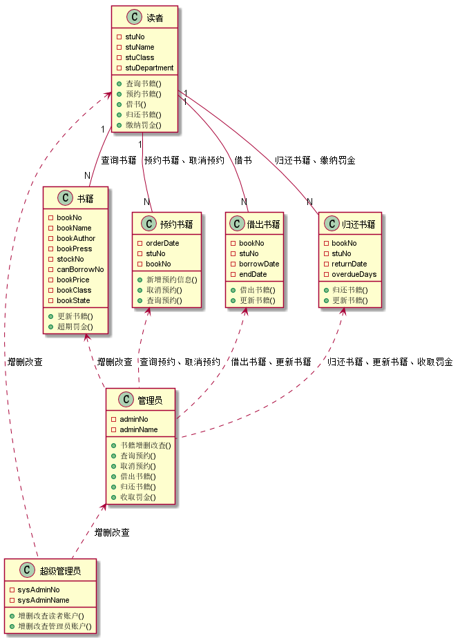
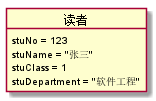
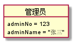
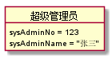
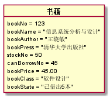
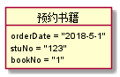
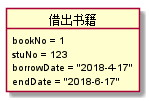
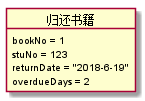

# 实验3：图书管理系统领域对象建模
|学号|班级|姓名|照片|
|:-------:|:-------------: | :----------:|:---:|
|201510414203|软件(本)15-2|陈亮||

## 1. 图书管理系统的类图

### 1.1 类图PlantUML源码如下：

``` class
@startuml

读者 : -stuNo
读者 : -stuName
读者 : -stuClass
读者 : -stuDepartment
读者 : +查询书籍()
读者 : +预约书籍()
读者 : +借书()
读者 : +归还书籍()
读者 : +缴纳罚金()

管理员 : -adminNo
管理员 : -adminName
管理员 : +书籍增删改查()
管理员 : +查询预约()
管理员 : +取消预约()
管理员 : +借出书籍()
管理员 : +归还书籍()
管理员 : +收取罚金()

超级管理员 : -sysAdminNo
超级管理员 : -sysAdminName
超级管理员 : +增删改查读者账户()
超级管理员 : +增删改查管理员账户()


书籍 : -bookNo
书籍 : -bookName
书籍 : -bookAuthor
书籍 : -bookPress
书籍 : -stockNo
书籍 : -canBorrowNo
书籍 : -bookPrice
书籍 : -bookClass
书籍 : -bookState
书籍 : +更新书籍()
书籍 : +超期罚金()

预约书籍 : -orderDate
预约书籍 : -stuNo
预约书籍 : -bookNo
预约书籍 : +新增预约信息()
预约书籍 : +取消预约()
预约书籍 : +查询预约()

借出书籍 : -bookNo
借出书籍 : -stuNo
借出书籍 : -borrowDate
借出书籍 : -endDate
借出书籍 : +借出书籍()
借出书籍 : +更新书籍()

归还书籍 : -bookNo
归还书籍 : -stuNo
归还书籍 : -returnDate
归还书籍 : -overdueDays
归还书籍 : +归还书籍()
归还书籍 : +更新书籍()

读者"1" -- "N"书籍:查询书籍
读者"1" -- "N"预约书籍 : 预约书籍、取消预约
读者"1" -- "N"借出书籍 : 借书
读者"1" -- "N"归还书籍 : 归还书籍、缴纳罚金

书籍 <.. 管理员:增删改查
借出书籍 <.. 管理员:借出书籍、更新书籍
归还书籍 <.. 管理员:归还书籍、更新书籍、收取罚金
预约书籍 <.. 管理员:查询预约、取消预约
读者 <.. 超级管理员:增删改查
管理员 <.. 超级管理员:增删改查

@enduml
```

### 1.2. 类图如下：




### 1.3. 类图说明：
说明文字***

## 2. 图书管理系统的对象图
### 2.1 类读者的对象图
#### 源码如下：
``` class
@startuml
object 读者 {
    stuNo = 123
    stuName = "张三"
    stuClass = 1
    stuDepartment = "软件工程"
}
@enduml
``` 
#### 对象图如下：



### 2.2 类管理员的对象图
#### 源码如下：
``` class
@startuml
object 管理员 {
    adminNo = 123
    adminName = "张三"
}
@enduml
``` 
#### 对象图如下：


### 2.3 类超级管理员的对象图
#### 源码如下：
``` class
@startuml
object 超级管理员 {
    sysAdminNo = 123
    sysAdminName = "张三"
}
@enduml
``` 
#### 对象图如下：


### 2.4 类书籍的对象图
#### 源码如下：
``` class
@startuml
object 书籍 {
    bookNo = 123
    bookName = "信息系统分析与设计"
    bookAuthor = "王晓敏"
    bookPress = "清华大学出版社"
    stockNo = 50
    canBorrowNo = 45
    bookPrice = 45.00
    bookClass = "软件设计"
    bookState = "已借出5本"
}
@enduml
``` 
#### 对象图如下：


### 2.5 类预约书籍的对象图
#### 源码如下：
``` class
@startuml
object 预约书籍 {
    orderDate = "2018-5-1"
    stuNo = "123"
    bookNo = "1"
}
@enduml
``` 
#### 对象图如下：


### 2.6 类预约书籍的对象图
#### 源码如下：
``` class
@startuml
object 借出书籍 {
    bookNo = 1
    stuNo = 123
    borrowDate = "2018-4-17"
    endDate = "2018-6-17"
}
@enduml
``` 
#### 对象图如下：



### 2.6 类预约书籍的对象图
#### 源码如下：
``` class
@startuml
object 归还书籍 {
    bookNo = 1
    stuNo = 123
    returnDate = "2018-6-19"
    overdueDays = 2
}
@enduml
``` 
#### 对象图如下：

