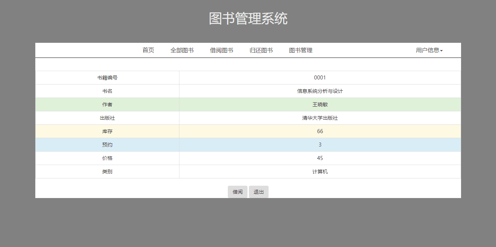

# 实验5：图书管理系统数据库设计与界面设计
|学号|班级|姓名|照片|
|:-------:|:-------------: | :----------:|:---:|
|201510414203|软件(本)15-2|陈亮||

## 1.数据库表设计

## 1.1. 图书表
|字段|类型|主键，外键|可以为空|默认值|约束|说明|
|:-------:|:-------------:|:------:|:----:|:---:|:----:|:-----|
|书籍编号|varchar(100)|主键|否||||
|书名|varchar(100)|否|否||||
|作者|varchar(100)|否|否||||
|出版社|varchar(100)|否|否||||
|库存|int|否|否||||
|预约|int|否|否||||
|价格|varchar(100)|否|否||||
|类别|varchar(100)|否|否||||


## 1.2. 预约表
|字段|类型|主键，外键|可以为空|默认值|约束|说明|
|:-------:|:-------------:|:------:|:----:|:---:|:----:|:-----|
|读者id|int|主键|否||||
|书籍编号|varchar(100)|否|否||||
|预约日期|datetime|否|否||||

## 1.3. 借书表
|字段|类型|主键，外键|可以为空|默认值|约束|说明|
|:-------:|:-------------:|:------:|:----:|:---:|:----:|:-----|
|读者id|int|主键|否||||
|书籍编号|varchar(100)|否|否||||
|借书日期|datetime|否|否||||
|还书日期|datetime|否|否||||

## 1.4. 还书表
|字段|类型|主键，外键|可以为空|默认值|约束|说明|
|:-------:|:-------------:|:------:|:----:|:---:|:----:|:-----|
|读者id|int|主键|否||||
|书籍编号|varchar(100)|否|否||||
|还书日期|datetime|否|否||||
|逾期天数|int|否|否||||

## 1.5. 读者表
|字段|类型|主键，外键|可以为空|默认值|约束|说明|
|:-------:|:-------------:|:------:|:----:|:---:|:----:|:-----|
|读者id|int|主键|否||||
|姓名|varchar(100)|否|否||||
|班级|varchar(100)|否|否||||
|专业|varchar(100)|否|否||||

## 1.6. 管理员表
|字段|类型|主键，外键|可以为空|默认值|约束|说明|
|:-------:|:-------------:|:------:|:----:|:---:|:----:|:-----|
|管理员id|int|主键|否||||
|姓名|varchar(100)|否|否||||

## 1.7. 超级管理员表
|字段|类型|主键，外键|可以为空|默认值|约束|说明|
|:-------:|:-------------:|:------:|:----:|:---:|:----:|:-----|
|超级管理员id|int|主键|否||||
|姓名|varchar(100)|否|否||||

***

## 2. 界面设计
## 2.1. 借书界面设计

- 用例图参见：借书用例
- 类图参见：借书类，读者类
- 顺序图参见：借书顺序图
- API接口如下：

1. 查询读者API

- 功能：用于获取全部读者信息
- 请求地址： http://localhost:8080/library/selectStu
- 请求方法：POST
- 请求参数：

|参数名称|必填|说明|
|:-------:|:-------------: | :----------:|
|读者id|是|用于查询指定的读者信息。 |
|method|是|固定为 “POST”。|

- 返回实例：
```
{
    "info": "查询成功。",
    "data": {
        "stuNo": "1",
        "stuName": "张三",
        "stuClass": "20152",
        "stuDepartment": "软件工程"
    },
    "code": 200
}
```
- 返回参数说明：
    
|参数名称|说明|
|:-------:|:-------------: |
|Info|返回信息|
|data|用户的个人信息|
|dodo|返回码|

2. 查询图书API
- 功能：用于获取全部图书信息
- 请求地址： http://localhost:8080/library/selectBook
- 请求方法：POST
- 请求参数：

|参数名称|必填|说明|
|:-------:|:-------------: | :----------:|
|bookNo|是|用于查询指定图书所有信息。 |
|method|是|固定为 “POST”。|

- 返回实例：
```
{
    "info": "查询成功。",
    "data": {
        "bookNo": "123",
        "bookName": "信息系统分析与设计",
        "bookAuthor": "王晓敏",
        "bookPress": "清华大学出版社",
        "stockNo": "66",
        "bookPrice": "45",
        "bookClass": "计算机",
    },
    "code": 200
}
```
- 返回参数说明：
    
|参数名称|说明|
|:-------:|:-------------: |
|Info|返回信息|
|data|用户的读者信息|
|dodo|返回码|


 3. 借阅图书API
- 功能：用于借阅图书
- 请求地址： http://localhost:8080/library/lendBook
- 请求方法：POST
- 请求参数：

|参数名称|必填|说明|
|:-------:|:-------------: | :----------:|
|stuNo|是|用于查询指定用户所有信息。 |
|bookNo|是|用于查询指定图书所有信息。 |
|method|是|固定为 “POST”。|

- 返回实例：
```
{
    "info": "借阅成功。",
    "data": {
        "result": "借阅成功",   
    },
    "code": 200
}
```
- 返回参数说明：
    
|参数名称|说明|
|:-------:|:-------------: |
|Info|返回信息|
|data|返回的结果|
|dodo|返回码|

4. 归还图书API
- 功能：用于归还图书
- 请求地址： http://localhost:8080/library/returnBook
- 请求方法：POST
- 请求参数：

|参数名称|必填|说明|
|:-------:|:-------------: | :----------:|
|stuNo|是|用于查询指定用户所有信息。 |
|bookNo|是|用于查询指定图书所有信息。 |
|method|是|固定为 “POST”。|

- 返回实例：
```
{
    "info": "还书成功。",
    "data": {
        "result": "还书成功",   
    },
    "code": 200
}
```
- 返回参数说明：
    
|参数名称|说明|
|:-------:|:-------------: |
|Info|返回信息|
|data|返回的结果|
|dodo|返回码|